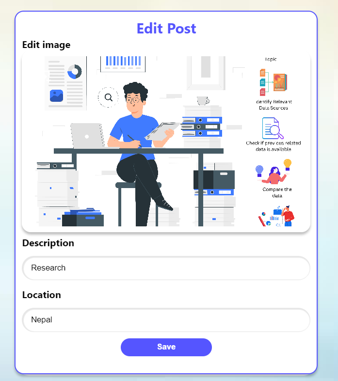

# Crowdly

Crowdly, a free-lancing social media platform, is aimed for simplifying recruiting and hiring process for the parties involved. With this system, employers, and potential employees could connect directly, efficiently cutting out the middleman. Moreover, with a real-time communication system integrated into this platform, employers can be confident about their applicants. In the favor of applicants, Crowdly offers total transparency in their application process by informing them about state of their application. The process of searching jobs remains one of the most hassled tasks in one’s professional life. Furthermore, the lack of transparency in the process leaves the applicants unsure about their application. This creates sort of an unprofessional atmosphere between the employer and the potential employee. To address these, Crowdly was founded. With this platform, the job searching process will be made easier and hassle free. The users can apply for any job that matches their qualifications and skill sets. Their profile will directly be sent to the employers without having to upload a CV. In the favor of Employers, the employers can commit to 100% transparency of application by providing them with status of their application.

Furthermore, the integration of social media platform will play positive role to form professional network of the parties involved. Users, both applicants and company, will be able to share their views and thoughts in the form of a post. This post will be accessible by the users who have followed the users in the Crowdly social media. The post, in respect to social media, have properties such as likes and comments which will allow other users to express their views or opinions. With regard to employer, the system allows employers or company to post job vacancies which contains information about the job such as job title, location, description and so on. The system, however, focuses on freelancing jobs or projects rather than on traditional jobs. Moreover, the system, like a freelancing platform, has a payment option to release payments to the employee/ candidate once the job is completed.

Talking about the minor features, Crowdly allows users to save jobs and posts into user’s personal accounts which can be latter visited by the user, if needed. In regard to improving communication, Crowdly offers real-time communication with the users. The employers can communicate with the candidates to clear any confusion or to make an offer. Similarly, the candidates can also message employers to explain their views regarding the job posting and explain their proposal directly. This system encourages communication from within our application and discourages irrelevant communication through third party applications such as Gmail or Outlook.

## Screenshots

